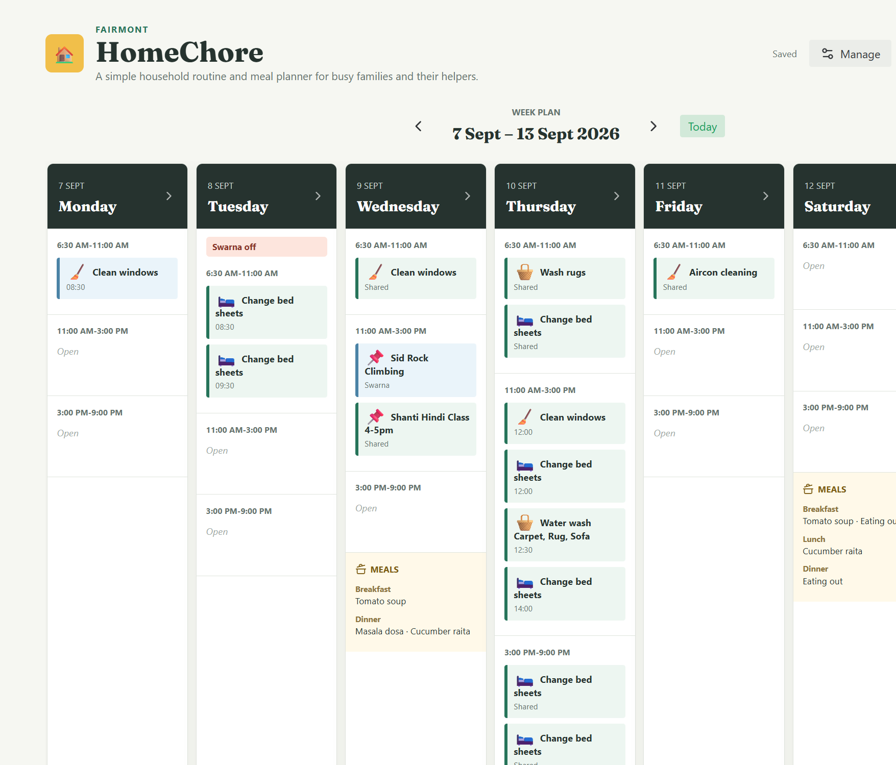

# HomeChore

HomeChore is a simple household routine and meal planner for busy families and their helpers. The Local Edition runs on one computer in a trusted home network, with no accounts or cloud service.




## Features

- Weekly overview and detailed Daily planning for Duties, Meals, and notes.
- Configurable Household identity, Assignees, off-days, and two to six Routine Periods.
- Optional 30-minute Duty times, emoji cues, Meal Option images, and shared local persistence.
- Browser printing plus Daily and Weekly PDF downloads.
- Friendly `chores.local:8787` access where the local network supports mDNS, with an IP-address fallback.

## Requirements

- [Node.js](https://nodejs.org/) 22.5 or newer.
- A trusted private network and a host computer that remains on while the planner is in use.

HomeChore has no accounts or sign-in. Every device that can reach the server can read and change the planner. Do not expose it directly to the public internet.

## Clone and Run

Clone the repository first:

```sh
git clone https://github.com/ricky11/homechore.git
cd homechore
```

### Windows

Open PowerShell in the cloned folder and run:

```powershell
npm install
npm run build
npm start
```

Open `http://localhost:8787/` on the host computer. If Windows asks, allow Node.js through the firewall on **Private networks**.

### macOS

Open Terminal in the cloned folder and run:

```sh
npm install
npm run build
npm start
```

Open `http://localhost:8787/` on the host computer. macOS may ask you to allow incoming connections for Node; allow it only on your trusted local network.

Keep the terminal running while HomeChore is in use. Press `Ctrl+C` to stop it.

### Share on Your Home Network

The start command prints a network address. On another device connected to the same private network, first try:

```text
http://chores.local:8787/
```

Some devices, browsers, Wi-Fi routers, and guest networks do not support `.local` discovery. In that case, use the Network address printed in the terminal, for example `http://192.168.50.143:8787/`. If devices still cannot connect, disable router client isolation and ensure they are not connected to guest Wi-Fi.

### Develop Locally

```sh
npm install
npm run dev
```

Vite runs the client on port `5173` and forwards API and Media Asset requests to the Hono server on port `8787`.

## Using the Planner

Use **Manage** to configure the Household name and icon, Assignees, days off, Routine Periods, Duties, emoji cues, and Meal Options. Changes are shared with all browsers using the same server.

The Weekly view provides an overview. Select a day to edit Duties, optional exact times, Meals, and notes. A new week begins blank; **Copy Previous Week Data** brings forward Duties only. **Download PDF** exports the active Daily or Weekly view, while **Print** uses the browser's print dialog.

## Stack and Design Choices

| Technology | Role | Why it is used |
| --- | --- | --- |
| Vue 3 + Vite | Client application | Vue keeps the planner responsive and component-oriented; Vite provides a fast local development and production build workflow. |
| Pinia | Client state management | A shared planner store keeps Household, weekly plan, catalog, persistence, and save status consistent across views without prop forwarding. |
| Node.js | Local backend runtime | Node lets a Household run the entire app with one familiar command and no external service. |
| Hono | HTTP server and API | Hono provides a small, explicit server for the built app, shared state API, Media Assets, and local-network access. |
| SQLite | Local persistence | SQLite keeps the shared planner in one portable local database without requiring a separate database service. |

The Local Edition deliberately favors understandable self-hosting over internet exposure: a single Node process serves the built app and API on the home network, while SQLite and uploaded Media Assets remain on the host computer.

## Photos, Storage, and Backups

Meal Option images up to 5 MB are resized to a 480px maximum edge and saved as compact WebP Media Assets.

- `data/homechore.db` contains schedules, Household settings, Duties, and Meal Options.
- `data/uploads/` contains Meal Option image files.

To back up HomeChore, stop it with `Ctrl+C`, copy `data/homechore.db` and the complete `data/uploads/` directory, then restart it with `npm start`. Do not copy the database while the server is running.

## Future Work

The Local Edition is the complete open-source planner for a trusted home network. The following ideas are intentionally deferred, not promised release dates:

- Optional cloud-hosted HomeChore for Households that need access beyond their home network; this may include accounts, remote access, paid plans, and professional-service features.
- Progressive Web App and offline support.
- In-app backup/download and restore, plus automatic startup after the host restarts.
- Optional port-80 and reverse-proxy deployment guidance for advanced self-hosters.
- Recurring Duty templates, an Assignee-focused Today view, missed-Duty notes, and calendar integration.
- Multilingual labels, meal-derived shopping lists, and QR-code access.
- Further refinement of the default Duty and Meal Option catalogs for individual Households.

## Project Layout

- `src/` contains Vue components, the Pinia store, shared utilities, and the starter catalog in `src/data/seed.json`.
- `server/` contains the Hono app and Node server bootstrap.
- `data/` contains local runtime data and is ignored by Git.
- `docs/images/` contains the README screenshots.
- `backup/original-index.html` preserves the original flat HTML prototype.
